Manual de Usuario del Suplementador Inteligente
###############################################

Bienvenidos al manual de usuario del Suplementador Inteligente! 

En este documento podrá encontrar las referencias y consejos para el uso y el mejor aprovechamiento del equipo.

Está demostrado que suplementar posee importantes ventajas, balanceando el rumen, mejorando la digestibilidad y equilibrando la dieta, lo que
se traduce en mayor producción y beneficios. Sin embargo suplementar de la manera tradicional tiene sus dificultades ya que es trabajoso y no
se puede regular la ingesta de cada animal, lo que conlleva a pérdida de eficiencia en el uso del alimento.

El Suplementador Inteligente posee las siguientes ventajas:

* **Facilita el Trabajo:** Funciona de forma automática, por lo que solo nos encargamos de llenar la tolva y ver los resultados.

* **Nos da el control:** Permite regular activamente la cantidad de alimento que come cada animal por día, en una o más fracciones diarias.

* **Aumento de la producción:** Al entregar a cada animal lo que necesita el incrementa la ganancia de peso del rodeo.

* **Ahorra alimento:** Al dar el suplemento de forma pareja y de acuerdo a las necesidades se estima un ahorro de entre 15% a 25% de alimento.

* **Autonomía:** El equipo trabaja de forma totalmente autónoma, no necesita conexión eléctrica ni conectividad de datos, por lo que se puede utilizar en absolutamente cualquier lugar. 

* **Tomamos mejores decisiones:** El equipo nos da información sobre su sobre la presencia de los animales (o ausencia) y su alimentación, lo que nos permite identificar situaciones y decidir en base a los datos registrados.

* **Seguimiento Remoto:** Puede ver el funcionamiento del equipo de forma remota y configurar alarmas para que le lleguen notificaciones (requiere acceso a red móvil).

* **Somos más eficientes:** Al poder regular la ingesta de cada animal usamos mejor el alimento, tenemos más información, reducimos el trabajo y podemos producir más, por ende somos más eficientes. 

En las primeras secciones puede conocer más sobre el :ref:`Funcionamiento General <funcGeneral>` y las :ref:`Recomendaciones de Uso <recomenUso>`.
También podrá ver cómo se realiza la :ref:`Programación <programacion>` y ver cómo se generan los :ref:`Reportes <reportes>`. . Finalmente se muestran la 
:ref:`Plataforma de Seguimiento Online <seguimientoOnline>` y :ref:`El manejo Remoto del Equipo <manejoRemoto>`.

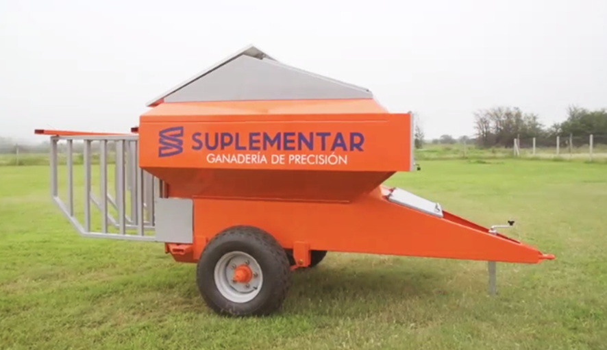
   
   Suplementador Inteligente a Campo

.. _funcGeneral:

Funcionamiento
==============

Características Generales
-------------------------

| El equipo facilita la tarea de administrar la suplementación nutricional de los vacunos a campo. El mismo trabaja suministrado porciones de suplementos. 
| Funciona con cualquier producto seco, ya sea en forma de harina, molido, entero o peleteado (Ej.: Maíz entero o partido, expeller de soja,  concentrados proteicos, productos comerciales, etc.). 
| Está concebido para funcionar de manera automática y autónoma en el lugar donde los animales están pastando, alimentándose con energía solar y almacenándola en baterías de ciclo profundo.
| El equipo de dos bocas de alimentación tiene una tolva de 3,3 metros cúbicos o aproximadamente 2,5 toneladas de alimento a granel. 
| Un solo equipo de dos bocas permite suplementar un rodeo de hasta 100 animales aproximadamente (dependiendo la categoría de animales y cantidad de fracciones diarias). 
| Funciona por medio de radiofrecuencia, tomando lectura de las caravanas electrónicas de los animales. Esto lo hace a través de antenas que se  ubican en las bocas de suplementación, una vez detectado y reconocido el animal suministra una cantidad de alimento previamente programada si es que corresponde de  acuerdo a la situación.
| Permite ser eficientes en el uso del suplemento nutricional ya que al registrar todos los datos respecto a la alimentación de cada animal, se logra un mejor control y  manejo de la nutrición del ganado.
| En las siguientes secciones se explica cómo utilizar el equipo; cómo programarlo y generar los reportes para supervisar el funcionamiento del mismo.

Modo de Operación
-----------------

| Para su funcionamiento, el equipo agrupa a los animales en *Rodeos*, es decir ,de grupos de animales que por lo general tendrán características similares y una configuración de suplementación compartida. Los Rodeos también sirven para organizar la información en los reportes.
| Se pueden elegir dos modos de operación:

**Modo de Rodeos Fijos**

| Este modo de operación permite dar diferentes cantidades de comida a distintas categorías, por más que estén mezclados en un mismo lote y es el que normalmente se utiliza una vez que los animales están cargados en el sistema.
| Cuando el equipo se activa en el modo de Rodeos Fijos se pueden seleccionar un rodeo o más de uno para que les dé alimento a esos animales.
| Cuando un animal ingresa a la boca, el equipo lo identifica mediante su caravana electrónica; busca al animal dentro de los rodeos seleccionados y le da la ración de alimento programada de acuerdo a su configuración si es que le corresponde. Si el animal no está cargado o pertenece a un rodeo no seleccionado, no recibirá comida.
| De esta manera, por ejemplo, podríamos asignarle 1 kg diario a un Rodeo de terneros y 2 kg diarios a un Rodeo de Vacas simultáneamente.

**Modo de Carga Automática**

| Este modo de operación facilita la carga de las caravanas electrónicas nuevas. Bajo este modo de operación se puede seleccionar solo un Rodeo y todo animal que ingrese a la boca de alimentación se carga en el Rodeo seleccionado. 
| Si el número de caravana electrónica no está cargado en el sistema, se crea un nuevo animal con nombre (caravana física) genérico y se agrega al Rodeo seleccionado, asignándole la animal la configuración de comidas del Rodeo. Si el animal estaba cargado en otro Rodeo se cambia al Rodeo seleccionado.

.. _programacion:

Programación
============

Pantalla Principal
------------------

La pantalla principal, con la que inicia el equipo, permite activar o desactivar el equipo para la alimentación mediante el botón *Automático On/Off*; acceder a la sección 
de *Programación*, en donde se pueden configurar el equipo; visualizar los *Reportes*, para ver los detalles del ingreso de los animales; y acceder a la pantalla de 
*Estado Diario* cuando el equipo está activado, en donde se puede observar de forma rápida y simple el porcentaje de ingesta del día de los animales activos.   

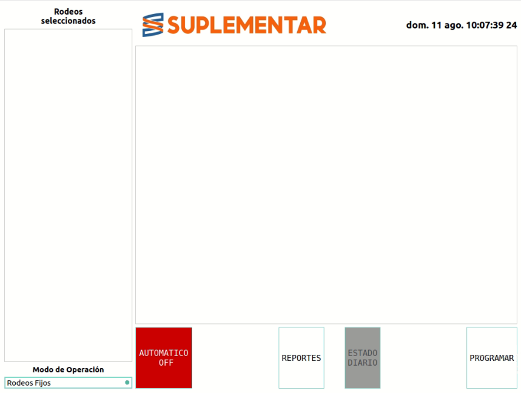
   
   Pantalla Principal

En la pantalla de programación veremos una barra inferior de botones principales que permite ir a las pantallas de **Rodeos y Animales**; la sección de **Alimento**;
las pantalla de **Gestión de Datos** o **Volver** a la pantalla principal. 

**Definición de Rodeos**

Al presionar el botón **Rodeos** podemos **Agregar**, **Modificar** o **Eliminar** los Rodeos que nos ayudarán a agrupar los animales y manejar su configuración de 
comidas y visualización de datos.

Al presionar en **Agregar** se despliega el menú para crear un nuevo Rodeo, en donde podremos definir un número de identificación y una descripción. 
Al presionar en **Guardar** el rodeo quedará definido.
También es posible modificar los datos de un rodeo o eliminarlo, seleccionándolo de la lista y presionando el botón **Modificar** o **Eliminar**.

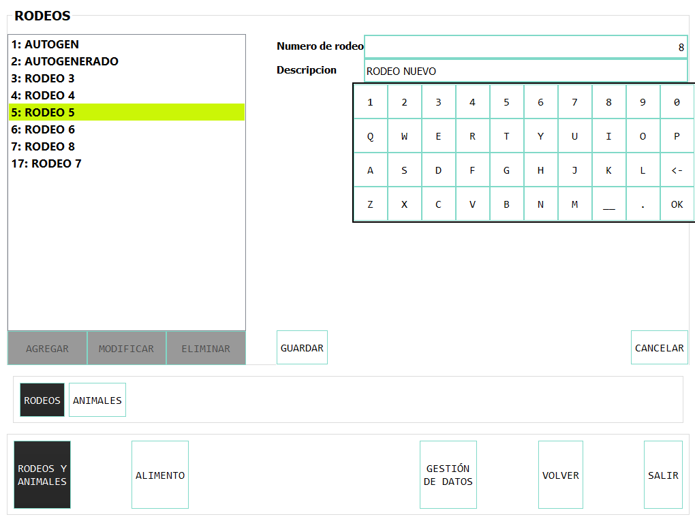
   
   Pantalla para Agregar o Modificar Rodeos

Al presionar en los recuadros de texto se despliega un teclado para escribir, al presionar el botón **Ok** el mismo se cierra.

**Definición Manual de Animales**

| Al presionar el botón **Animales** podremos **Agregar** animales manualmente (ver opción de Carga Automática); **Eliminar** los mismos; **Modificar** sus datos o **Buscar** un animal ya cargado para modificarlo.
| Para **Agregar** un nuevo animal debemos seleccionar el rodeo de la lista existente, ingresamos *Número de Caravana* (Caravana Física, tarjeta o identificación propia) y el *Número de Tag* (número que tiene impreso la caravana electrónica).
| Al seleccionar **Guardar** quedan registrados los datos. Este proceso se repite para incorporar todos los animales a los que se quiere suplementar.
| Una vez guardados los animales figuran en la lista de la izquierda, en donde figura el número de rodeo, seguido de la identificación y el número de Tag. ( Por ejemplo *R1: TORO JOVEN 1 (809123565445612)* ).
| Generalmente los números de caravanas y de caravanas electrónicas son sucuenciales, o se repite la mayoría de los números, para esto se pueden utilizar los botones **Copiar** y **Pegar**, que facilitan el ingreso de los datos.
| También se puede modificar los datos de un animal o eliminarlo seleccionándolo de la lista. 

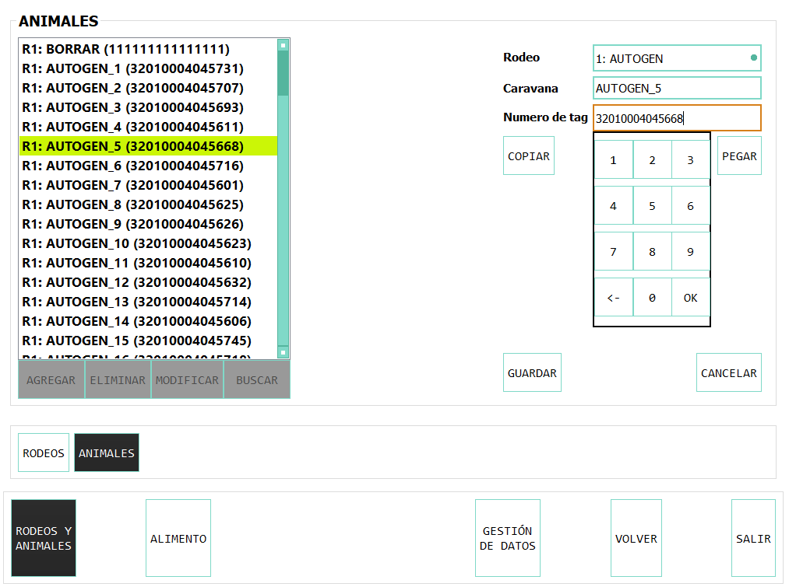
   
   Pantalla para Agregar Animales

**Búsqueda de Animales**

| También es posible buscar animales ya cargados para modificar los datos o cambiarlos de rodeo. Es posible buscar un animal por Caravana o por Tag (número de caravana electrónica). 
| De existir el animal con los datos ingresados en la base de datos quedará seleccionado de la lista de animales para su modificación.

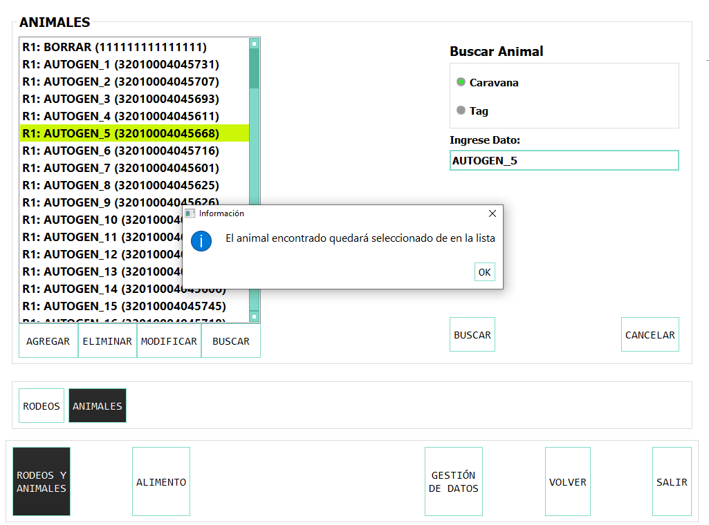
   
   Pantalla para Buscar Animales

**Parámetros de Alimentación**

| El siguiente paso es definir los parámetros de alimentación del rodeo. Para esto debemos presionar el botón principal **Alimento** y luego en **Asignar**. 
| Los parámetros de alimentación se pueden definir por rodeo, es decir de manera grupal a todos los animales que lo integran o de manera individual,  es decir parámetros especiales sólo para este animal. Al ingresar a la pantalla de dosificación  aparecerá una lista que contiene los rodeos existentes  resaltados en color *azul* y bajo cada rodeo se muestran los animales que contienen por medio de su caravana física. 
| Si los animales no están remarcados en la lista significa que se guiará por la definición grupal pero si un animal se encuentra resaltado en color *verde*, significa  que tiene asignado parámetros de suplementación individual.
| El rodeo o animal que ud. seleccione se verá resaltado de color *amarillo*, como en las demás pantallas.
| Para definir los parámetros para todo el grupo (por rodeo) se selecciona el rodeo de la lista y se presiona el botón **Modificar Rodeo**, cuando se selecciona un animal el botón cambia su descripción a **Modificar Animal**, por lo que estaremos modificando a ese animal solamente y los parámetros del Rodeo permanecerán sin cambios.
| En caso de querer borrar la configuración individual y resetear sus parámetros de alimentación a los valores del Rodeo al que pertenece se debe seleccionar del listado y se habilitará el botón **Tratar Como Grupo**, que permite borrar su configuración individual.

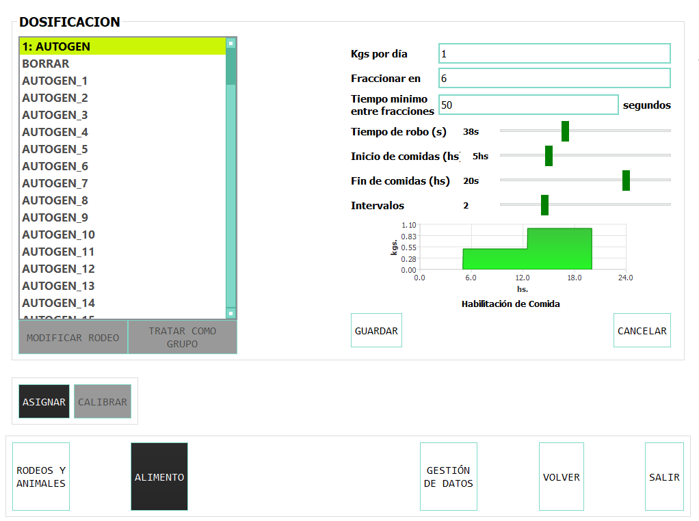
   
   Pantalla de Parámetros de Alimentación

En la pantalla que se abre se configuran los siguientes parámetros de alimentación:

* **Peso diario:** Es la cantidad de alimento a suministrar por día.
* **Fraccionar en:** Cantidad de fracciones en las que se repartirá esa cantidad diaria de alimento. Por ejemplo, si se asignan 2 Kg diarios y 5 fracciones, el animal recibirá 400 gramos por ingreso, hasta completar su ración diaria.
* **Tiempo mínimo:** Es el tiempo medido en segundos que debe pasar como mínimo para autorizar una comida después de la anterior. Se recomienda que se configure en un valor igual o superior al tiempo que el animal demora en levantar la fracción suministrada.
* **Tiempo de Robo:** Es el intervalo de tiempo que pasa entre que un animal recibe su ración y en el que el equipo registrará un robo en el caso de que otro animal ingrese a la misma boca de expendio. 
* **Inicio de Comidas:** Es el horario a partir del cual los animales podrán recibir sus raciones. 
* **Fin de Comidas:** Es el horario a partir del cual los animales no podrán recibir más sus raciones. 
* **Intervalos:** Se utiliza para repartir la ingesta de comida durante el día, dividiendo el período habilitado para poner límites temporarios de ingesta.

**Ejemplo de Configuración de Alimento**

Si configuramos la alimentación con los siguientes parámetros:

| Peso diario: 2 kilogramos
| Fraccionar en: 6 fracciones
| Tiempo mínimo: 50 segundos
| Tiempo de Robo: 30 segundos 
| Inicio de comidas: 4 hs. 
| Fin de comidas: 24 hs.
| Intervalos: 2

El animal en cuestión recibirá como máximo 2 kilogramos de suplemento diario, divididas en 6 fracciones de 333 gramos cada una. Podrá recibir el alimento entre 
las 4 hs y las 24 hs El tiempo mínimo que pasará entre que recibió una fracción y que el equipo le habilite la siguiente es de 50 segundos. Si un animal recibió una 
fracción y dentro de los 30 segundos entra otro animal, se le imputará el robo de comida al segundo animal, con una cantidad proporcional al tiempo restante.
Como hemos seleccionado 2 intervalos, el período habilitado, que es de 20 horas (entre las 4hs. y las 24 hs) se divide en dos etapas de 10 horas (la primera entre las 
4 hs. y las 14 hs y la segunda entre las 14 hs y las 24 hs). En la primera etapa al animal se le dará comida hasta llegar a un máximo de 1 kg. y a partir de las 14 hs 
se habilitarán las fracciones restantes hasta los 2 kgs configurados.   

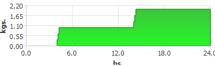
   
Gráfico de habilitación de comida con 2 intervalos.

Si en cambio configuramos 3 intervalos, las etapas durarán 6:40 hs (20 hs / 3 = 6.66 hs) La primer etapa durará desde las 4 hs hasta las 10:40 hs y tendrá un máximo de 
comida de 0.66 kgs; la segunda etapa se extenderá desde las 10:40 hs. hasta las 17:20 hs con un máximo de comida de 1.33 kgs  y a las 17:20 hs el límite de comida pasa
a ser los 2 kgs configurados.

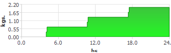
   
Gráfico de habilitación de comida con 3 intervalos.

**Tiempo de Robo**

| Como todo grupo social existen animales dominantes, que en algunas ocasiones intentan robar la comida de otro animal, corriéndolo de la boca de expendio. 
| Para esto el equipo tiene rejas de protección, sin embargo, aún con esta protección algunos animales dominantes pueden lograr desplazar al animal e ingresar 
 a la boca cuando todavía hay comida del animal que se está alimentando. 
| Para poder registrar dichos comportamientos existe un parámetro que se llama *Tiempo de Robo*. Este parámetro se calcula en relación al tiempo, en segundos, que tarda el animal en comer la fracción suministrada. 
| Se aconseja calcular el tiempo de robo en un 75% del tiempo en que tarda en levantar la ración un animal. Los estudios que hemos realizado nos aconsejan calcular 10 segundos por cada 100gr. 
| Por ejemplo, para fracciones de 200 gramos, se calcula un tiempo de robo de 20 segundos.

**Horarios de Comidas**

Los horarios de Inicio y Fin de Comidas son útiles por dos motivos. El primero es para no alterar el ritmo natural de los animales, ya que por experiencia sabemos que los animales 
aprenden sobre el horario en que se habilitan las comidas y si se habilitan las comidas al cambiar el día (a las 0 horas) existen animales que esperan ese horario para alimentarse.
El segundo motivo es que permiten aumentar la cantidad de animales que pueden utilizar el equipo, su configuración escalonada generalmente es necesaria cuando el equipo se utiliza 
con más de 90-100 animales

Calibración de Dosificación
---------------------------

| La calibración de dosificación se debe realizar solamente al poner en funcionamiento el equipo por primera vez o en caso de cambiar el tipo de suplemento. 
| Se ingresa a la pantalla presionando **Alimento** y luego **Calibrar**. 
| Para una calibración más certera la calibración se realiza con una cantidad de alimento que sea similar a las fracciones que el equipo suministrará luego en modo automático. 
| Es por esto que el primer paso consiste en ingresar el peso en gramos con el que se desea calibrar. Luego se selecciona la boca de expendio que se quiere calibrar. 

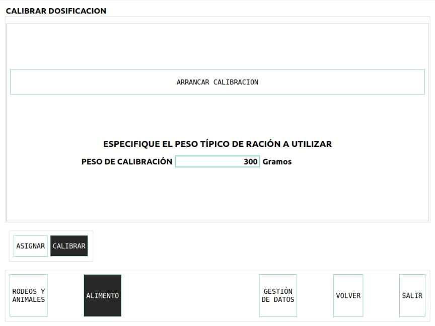
   
   Pantalla de Calibración - Seleccion de Peso

| Se necesita una balanza de cocina y un recipiente, que debe ser tarado en la balanza antes de empezar. Se coloca el recipiente en la boca y se presiona **Continuar**. 
| La máquina suministra alimento que debemos pesar para ingresar el valor en la pantalla. 
| Este proceso se repite 4 veces para mayor precisión (el número de repeticiones se puede cambiar). El equipo ajusta automáticamente los parámetros para que se suministre la cantidad adecuada en el modo de operación normal. 
| El margen de error en el suministro del dosificador va depender de la presentación del alimento, el error medio se encuentra entre 3 a 6% generalmente.

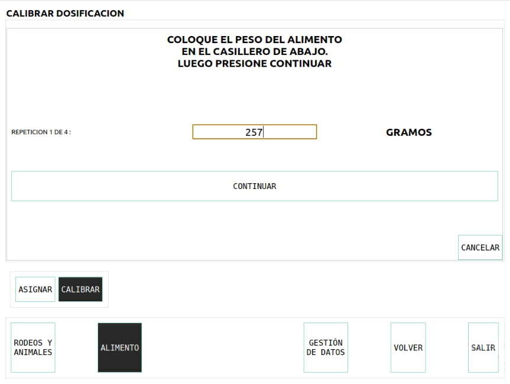
   
   Pantalla de Calibración - Ingreso del valor pesado

Modo de Operación Automático
----------------------------

| Para dejar al equipo en funcionamiento, es decir a la espera del ingreso de los animales para suplementarlos, se debe activar el modo de funcionamiento automático. 
| Esto se hace presionando el botón **Automático** en la pantalla principal.
| Una vez activado el modo automático se mostrará en la lista de la izquierda la descripción de los rodeos activos; la cantidad de animales que contienen y la cantidad de comida asignada grupalmente.

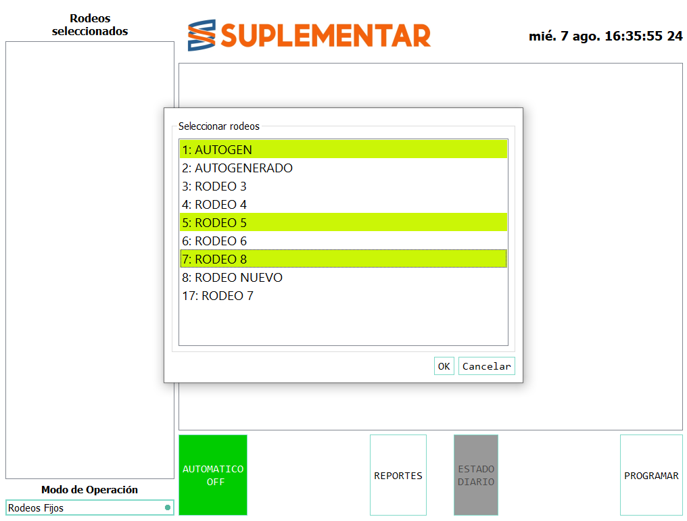
   
   Pantalla de Activación de Modo Automático

**Modo de Rodeos Fijos**

Este modo de operación permite activar *uno o más rodeos simultáneamente* por lo que se pueden dar diferentes cantidades de comida a distintas categorías, por más que estén mezclados en un mismo lote. 
Cuando un animal ingresa a la boca, el equipo lo identifica mediante su caravana electrónica; busca al animal dentro de los rodeos seleccionados y le da la ración de alimento programada si es que le corresponde. 
Si el animal no está cargado o pertenece a un rodeo no seleccionado, no recibirá comida.
Se registrarán los animales que están cargados en Rodeos no activados y los números de caravanas electrónicas que no están cargados en el sistema.

**Modo de Carga Automática**

Seleccione este modo de operación para que los animales que se acerquen se carguen automáticamente al Rodeo seleccionado. Si el número de caravana electrónica que el equipo registre 
no está cargado en el sistema, se crea un nuevo animal con el nombre (carvana física) genérico *AUTOGEN_* seguido de un número que se genera secuencialemnte y se agrega al Rodeo seleccionado, 
asignándole al animal la configuración de comidas del Rodeo. Si el animal estaba cargado en otro Rodeo el animal es cambiado al Rodeo seleccionado.

**Registro de Datos**

Mientras el equipo esté en el modo automático registrará todos los datos de operación, es decir que para cada animal que ingrese con una caravana electrónica, almacenará toda la información en una base de datos, 
es decir: cuál animal ingresó, en qué momento lo hizo, cuánto alimento se suministró y si hubo un robo, y en caso afirmativo cuál animal robó.  

**Información en Pantalla**

En el modo de operación automático, el equipo muestra en su pantalla la información sobre los últimos ingresos en cada boca de alimentación.
El registro de operación puede mostrar los siguientes estados: 

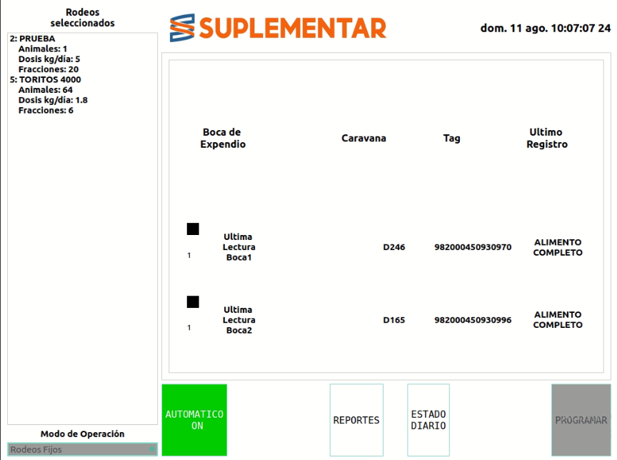
   
   Pantalla Modo Automático - Información de Actividad

* **Dosificando**
 
Esta leyenda se muestra al suministrar el alimento e incluye: el número de fracción diaria; el número de fracciones configurado; la cantidad de suplemento entregado; la ración diaria configurada y 
el porcentaje que representa. 

* **Alimento Completo**

Esta leyenda se muestra cuando el animal ya ha recibido la totalidad de las fracciones configurada y no se le administra comida.

* **Limite Alcanzado**

Esta leyenda se muestra cuando el animal ya ha recibido la totalidad del alimento permitido en el intervalo correspondiente.

* **Robo Registrado**

Esta leyenda se muestra cuando se detecta un robo, es decir cuando se le administra suplemento a un animal y dentro del período de tiempo configurado ingresa otro animal. 
Esta situación es identificada como un robo que se imputa al segundo animal.

* **Fuera de Horario**

Esta leyenda indica que el animal que entró a la boca de expendio lo hizo en un horario que no está habilitado para el mismo.

* **Mal Rodeo**

Esta leyenda se muestra cuando el animal que ingresó se encuentra registrado en la base de datos pero está en un rodeo que no ha sido seleccionado para ser suplementado en el momento de activación del equipo. 
No significa que represente un error pero se informa a los efectos de que el usuario pueda conocer la situación y para que pueda verificar que no se trate de un error de carga de datos. 

* **No Existe**

Esta leyenda se muestra cuando el animal que ingresó no se encuentra registrado en la base de datos, es  decir que el número de caravana electrónica no se grabó en ningún rodeo. 
Al igual que la situación anterior se informa a los efectos de que el usuario pueda conocer la situación y para que pueda verificar que no se trate de un error de carga de datos. 

Gestión de Datos
----------------

| Presionando el botón **Gestión de Datos** desde la pantalla de programación se accede a esta pantalla que permite realizar una serie de operaciones relacionadas con el manejo de los datos registrados. 
| El primer botón de **BackUp de Datos en USB** que permite grabar una copia de la base de datos del equipo en un pendrive conectado al puerto USB. 
| La segunda opción es **Restaurar Datos desde USB** en la cual se produce la operación inversa, es decir se configura el equipo con los datos previamente guardados en un dispositivo de almacenamiento. 

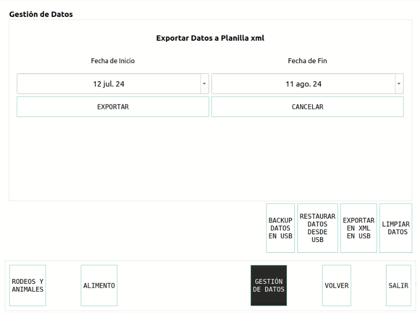
   
   Pantalla de Gestión de Datos – Exportar a en Formato XML

| La siguiente opción de **Exportar en XLM en USB** permite grabar los datos del equipo en un formato XLM para poder visualizarlos en una planilla de cálculo (Excel). 
| Esta opción graba en la primera pestaña los rodeos definidos y la cantidad de animales que contienen; en las siguientes pestañas la información de los animales de cada rodeo y los parámetros de alimentación 
 configurados para cada uno y finalmente una pestaña con todos los registros de alimentación grabados por el equipo dentro del período seleccionado en la pantalla. 
| Cada registro incluye la caravana física y 
 electrónica del animal que ingresó; el rodeo al cual pertenece; la cantidad de suplemento administrada; la fecha y hora de administración y la clasificación descripta anteriormente, es decir, si se trató 
 de una comida normal, de un robo, un animal en rodeo no activo o un animal no registrado en la base de datos.

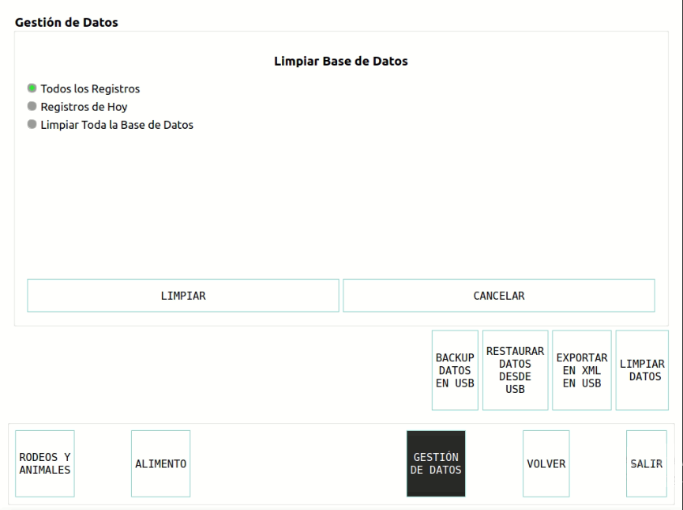
   
   Pantalla de Gestión de Datos – Limpiar Datos

La última opción es **Limpiar Datos**. Esta opción permite borrar los datos que se van acumulando debido a la programación o a lo largo de la operación del equipo. La primera posibilidad es borrar todos los 
registros de comidas pero mantener la definición de Rodeos, Animales y Parámetros de Alimentación. La segunda posibilidad es borrar el registro de comidas suministradas del día, esta opción sirve cuando se 
han realizado pruebas sobre el uso del equipo y no se quiere alterar la base de datos en días anteriores. La tercera posibilidad es borrar absolutamente todos los datos y dejar al equipo como sale de fábrica.

.. _reportes:

Reportes
========

Estado Diario
-------------

Cuando se ha activado el equipo se puede acceder, presionando el botón **Estado Diario**. Esta pantalla muestra todos los animales que activos y el porcentaje de comida que ha ingerido en el día. 
Los animales se muestran en una columna por rodeo, ordenados desde los que menos comieron a los que mayor porcentaje ingirieron. De esta manera se puede visualizar de forma simple y rápida para identificar 
situaciones como animales que no están comiendo y ver el funcionamiento general. 

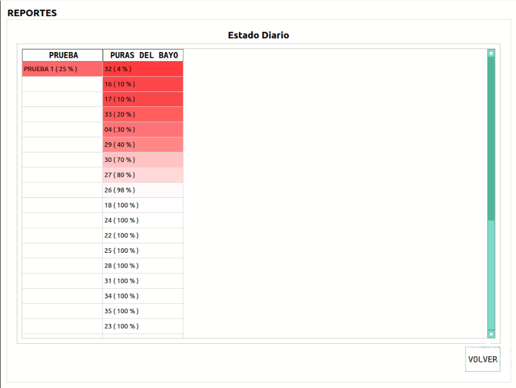
   
   Pantalla de Estado Diario de Alimento

Reporte de Alimentación
-----------------------

Se puede acceder a la información detallada sobre el funcionamiento del equipo y la alimentación suministrada a los animales presionando el botón **Reportes** en la pantalla principal. 
Los Reportes se organizan de acuerdo a los Rodeos seleccionados, para los que se filtra la información a a mostrar. Los Rodeos a incluir en el reporte se pueden seleccionar en la parte izquierda de la pantalla. 
También debemos seleccionar una fecha de Inicio y una fecha de Fin que limita el período del reporte a mostrar.
Una vez seleccionadas las fechas se muestran los datos principales al presionar el botón **Mostrar**. 
En los datos resaltados se puede presionar para acceder a listados o tablas que muestran en detalle esa información.

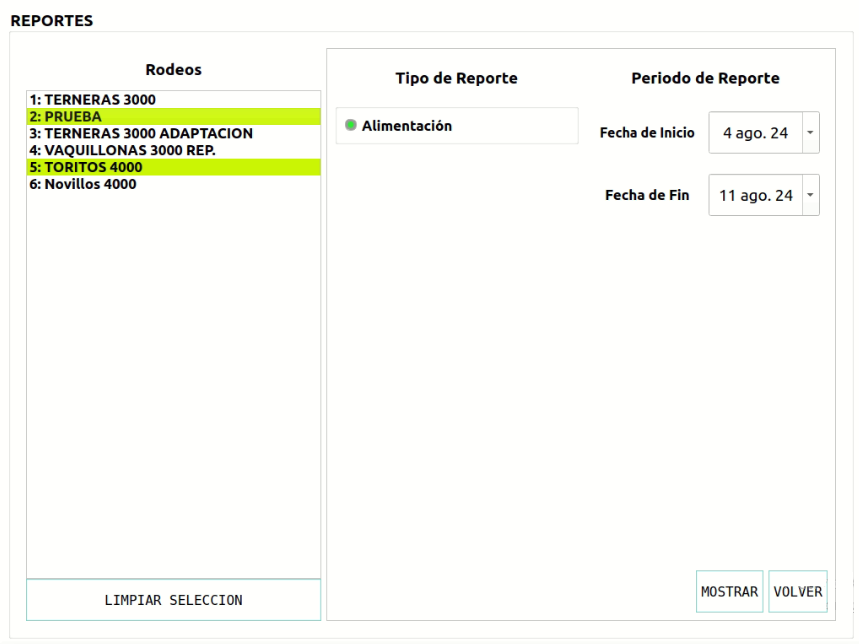
   
   Pantalla de Reporte, selección de Rodeos y Fechas

En la parte superior se muestran el o los rodeos considerados en el Reporte.

Debajo de esto se muestra una tabla con datos generales: 

* Fecha de Inicio y Fin del reporte
* Cantidad de días evaluados
* Cantidad de Animales (que contienen los Rodeos seleccionados)
* Promedio de la cantidad de alimento diario asignado 
* Promedio de cantidad de fracciones diarias asignadas
* Eficiencia Global 
* Robos Totales
* Animales Deshabilitados
* Animales No Cargados
* Animales sin entrar en 3 días
* Eventos Sin Comida
* Total de alimento dado

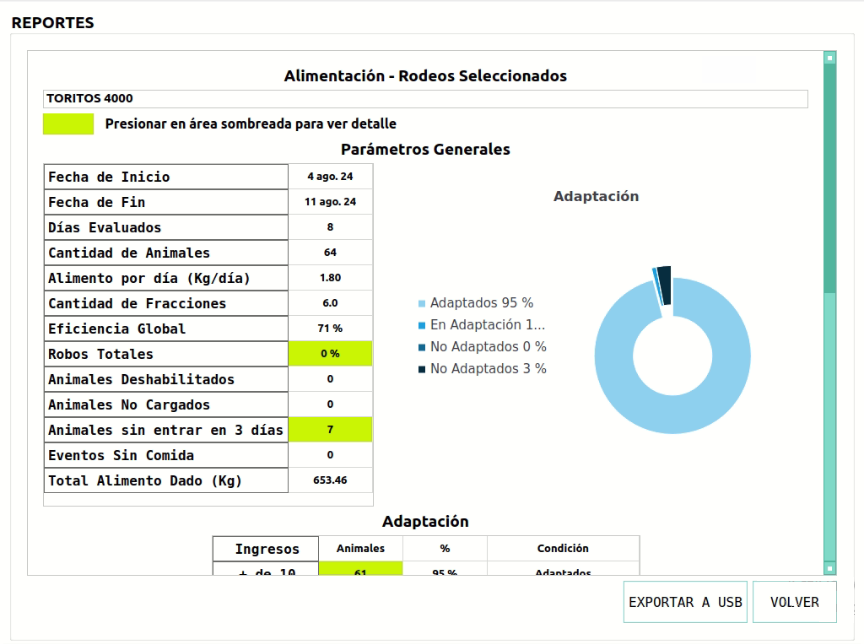
   
   Pantalla de Reporte – Datos Principales

| La eficiencia Global indica qué porcentaje de suplementación suministró equipo durante dicho periodo. Es  la relación entre la cantidad de veces que el equipo efectivamente suministró una ración sobre la cantidad de veces máximas que el equipo podría haber funcionado. Por ejemplo, si seleccionamos un lapso de 20 días y si hay 100 animales en el rodeo habilitado con 5 raciones por día, la cantidad máxima de veces que el equipo puede funcionar es de 20 días x 100 animales x 5 raciones = 10.000 veces. Entonces, si el equipo marca una eficiencia global de 83 % quiere decir que en el período seleccionado administró alimento unas 8.300 veces.
| Además muestra el porcentaje total de robos registrados respecto al peso de alimento total suministrado.
| Los animales que han ingresado en el período seleccionado a las bocas de expendio pero que no recibieron comida por estar en *Rodeos No Habilitados* se muestran presionando el recuadro de **Animales Deshabilitados**.
| Lo mismo sucede con los números de Caravanas que fueron identificadas pero que no están cargadas en el sistema, que figuran como **Animales No Cargados**.
| Otro dato importante son los **Animales sin entrar en 3 días**, ya que podemos identificarlos presionando sobre el recuadro y verificar si son animales que se perdieron o están enfermos por ejemplo. 
| Finalmente se muestra la cantidad de alimento total que el equipo suministró en el período seleccionado.

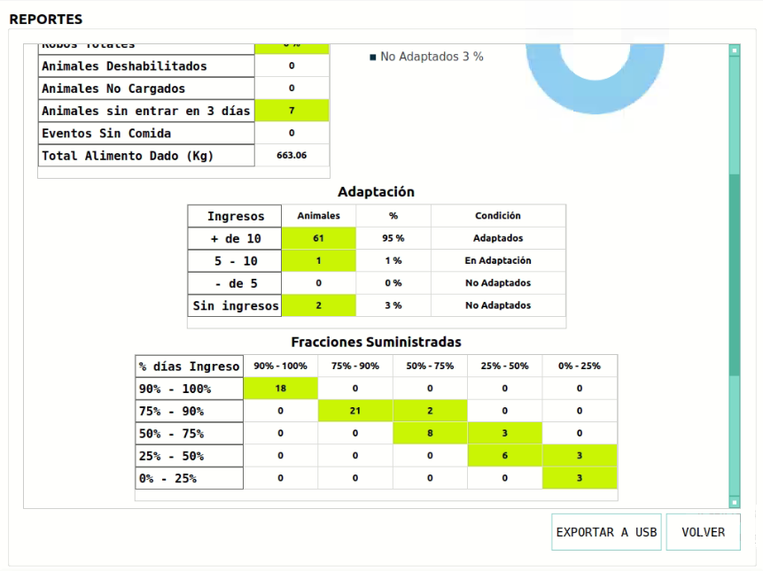
   
   Tablas Generales de Reporte

Más abajo el reporte muestra en una tabla de Adaptación, es la clasificación de animales según las veces que han recibido comida. Esta tabla sirve para evaluar el proceso de adaptación, ya que los animales se clasifican 
en *Adaptados* si han recibido comida más de 10 veces, *En adaptación* si han recibido entre 5 y 10 raciones y *No adaptados* si han recibido suplementación menos de 5 veces o no han ingresado.

La siguiente tabla que muestra el reporte es una tabla de doble entrada, que permite hacer una evaluación más detallada.  El primer criterio utilizado es el porcentaje global de raciones recibida de cada 
animal y el segundo criterio es el porcentaje de días en los que el animal ha utilizado el equipo.

El reporte muestra un gráfico de barras donde se ve la distribución horaria de todas las comidas suministradas, en donde el valor de cada barra representa el porcentaje de ingresos en cada franja horaria.
Este gráfico es útil para conocer el comportamiento animal y estimar la capacidad de reserva del equipo. Por ejemplo, si las raciones están habilitadas desde las 5 hs hasta las 22 hs y vemos que 
la eficiencia de suplementación es alta (mayor al 90%) y además las comidas se suministraron en su gran mayoría hasta antes de las 14 hs, indica que el equipo, en 9 hs de actividad pudo suplir la demanda 
y que quedó ocioso las otras 8 hs. Esto indica que probablemente se pueda ampliar la cantidad de animales que se están suplementando.

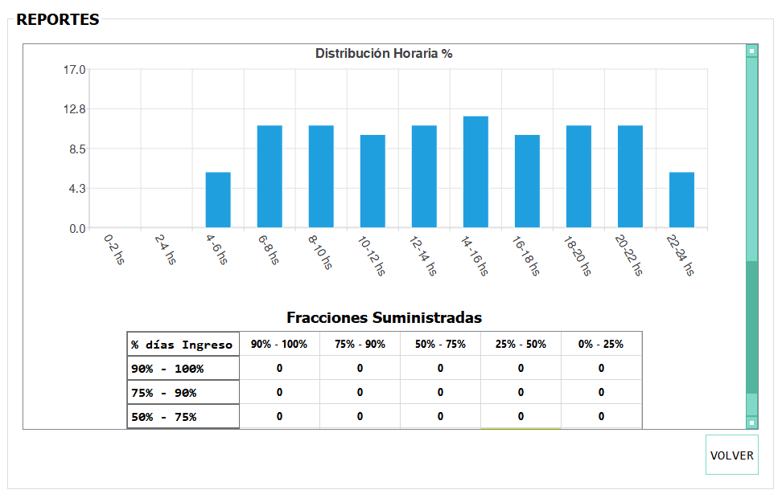
   
   Gráfico de Distribución Horaria

Listados con Detalles
---------------------

Al presionar sobre los recuadros resaltados en color amarillo se accede al listado de animales que se encuentran en esa categoría. Por ejemplo, al presionar sobre el porcentaje de robos totales, se muestra 
una tabla con un listado de los animales que han robado, la cantidad de veces que lo han hecho, ordenada de mayor a menor. Además se muestra un porcentaje que representa la relación entre el peso de comida 
robada diaria promedio por ese animal respecto al peso diario asignada. Esto permite evaluar las situaciones de robo y tomar decisiones en cuanto a los animales que tienen este comportamiento, como por ejemplo, 
bajar la dosis individual al mínimo o apartarlos del rodeo. 

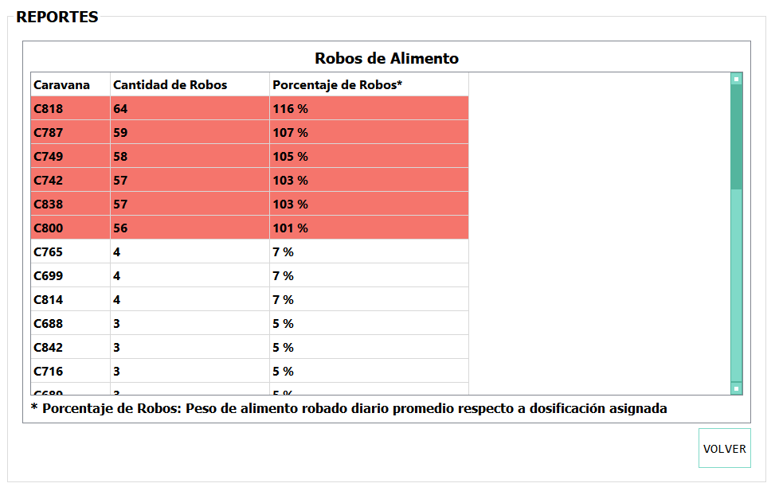
   
   Tabla de Registro de Robos

Al presionar sobre la cantidad de **Animales Deshabilitados** se muestra una tabla que contiene a los animales que han ingresado a la boca de alimentación que estaban cargados en Rodeos que en ese momento 
no estaban habilitados para suministrar alimento. 
Al presionar sobre la cantidad de **Animales No Cargados** se muestra una tabla de animales que ingresaron a comer cuyos números de caravanas electrónicas no estaban registrados en la base de datos. 
Esta información se muestra a los efectos de que el usuario pueda verificar que no se trate de un error de carga de datos. 

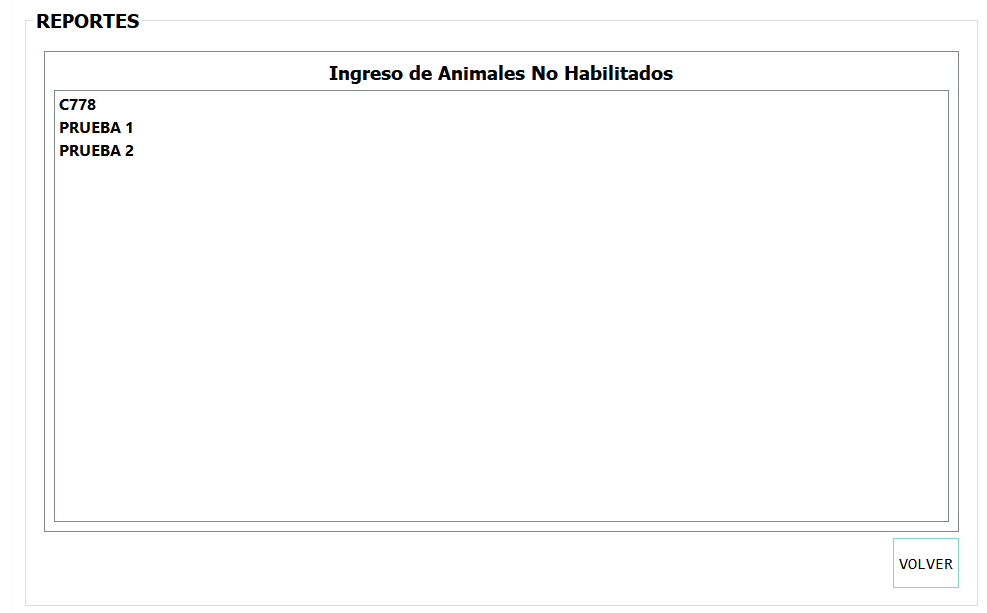
   
   Tabla de Animales en Rodeos Deshabilitados, Animales No Registrados y Guardado en formato PDF

Puede grabar el informe en un archivo con formato PDF en un pendrive presionando el botón **Guardar PDF**.

.. _seguimientoOnline:

Plataforma de Seguimiento Online
================================

En el caso de disponer de conexión por red móvil en lugar donde está ubicado el equipo es posible incorporar un módulo de comunicación. Este módulo enviará información periódicamente para que el usuario 
pueda, a través de una plataforma de seguimiento Online ver el estado del equipo en tiempo real, a la cual se puede acceder desde una computadora o celular.

La información que se puede ver en la plataforma es la siguiente:

**Información General**

* Estado: Manual o Automático
* Información de Fallas
* Rodeos Seleccionados para Alimentación
* Cantidad de Animales
* Ración Diaria (Kg/día)
* Cantidad de Raciones al día
* Intervalo entre Fracciones
* Nivel de carga de Alimento en Tolvas
* Nivel de Carga de Baterías
* Ubicación Geográfica del Suplementador

**Información del Día**

* Eficiencia de Suplementación del día
* Cantidad de Animales que Entraron
* Cantidad de Animales que No Entraron

**Información de los últimos 3 Días**

* Eficiencia de Suplementación en los últimos 3 días
* Porcentaje de Robo en los últimos 3 días
* Animales que no entraron en los últimos 3 días

A su vez la plataforma se puede configurar para que emita Alarmas, es decir mande un correo electrónico o un mensaje de texto en caso de que el nivel de carga de Tolva baje de cierto nivel, o baje el nivel 
de carga de las baterías o si un determinado animal no entró en los últimos 2 días, entre otras situaciones.

.. _manejoRemoto:

Manejo Remoto del Equipo
========================

El suplementador Inteligente tiene instalado el programa AnyDesk para el acceso de forma remota cuando se tiene señal a través de la red móvil. Debido a que el equipo está concebido para poder trabajar de forma 
autónoma, trabaja con una base de datos local. Todos los datos de configuraciones se guardan en esta base de datos, junto con la información cada vez que se registra el ingreso de un animal.

Es por esto que para trabajar de forma remota hay dos formas distintas de interaccionar:

**Modo de Trabajo En el Suplementador**

En este modo se trabaja con la base de datos que tiene el suplementador, manipulando la pantalla desde nuestra computadora como si estuviésemos en el campo.

**Permite**: Visualizar y cambiar las Configuraciones; Agregar/quitar Rodeos y Animales; Modificar parámetros de Alimentación; Activar o desactivar la alimentación (Modo Automático / Manual) y todo lo 
que se puede hacer con el equipo como si lo manejáramos desde el lote.

**No permite**: Guardar en nuestra computadora los archivos que se generan como: Reportes en formato PDF (a través de la pantalla de Reportes) y Planilla de Datos .xml (a través de la pantalla de Gestión de Datos).

**Modo de Trabajo en nuestra computadora**

| En este modo se debe copiar la base de datos del equipo en nuestra computadora y trabajar el mismo software del equipo pero con una versión para computadora.
| Los cambios que hagamos en nuestra computadora No tendrán efecto en el suplementador, salvo que una vez realizados los cambios, volvamos a subir el archivo de base de datos al suplementador.

**Permite**: Además de ver los datos y configuraciones como en la opción anterior (Modo de trabajo En el suplementador), permite generar Reportes y Planillas de Datos .xml y guardar los archivos en nuestra computadora.

**No permite**: Activar o desactivar la alimentación (Modo Automático / Manual ) Es necesario: Tener la versión para PC del software de Suplementar en nuestra computadora.

**Importante**: Si realiza modificaciones y pisa la base de datos del equipo con la base de datos modificada en la computadora se actualizarán todos los cambios en el equipo y se perderá la información que el equipo guardó 
en el período desde el cual se sacó la base de datos desde el equipo.

**Opcion Adicional**

Hay una tercera opción que consiste en trabajar en nuestra computadora para configurar Rodeos, Animales y Configuración de Alimentación a partir de un archivo nuevo o bajado del equipo, para luego subir este archivo al 
Suplementador y que el mismo trabaje con la configuración editada.

Conexión con el equipo
----------------------

Para conectarse al equipo debe abrir el programa AnyDesk en su computadora e ingresar el número de identificación (Típicamente tiene este formato: 210 695 358) del equipo en la barra superior (Indicado con la flecha azul) 
y presionar Enter o hacer click en la flecha gris en el costado derecho. En ese momento el programa la pide la contraseña de acceso brindada por Suplementar.

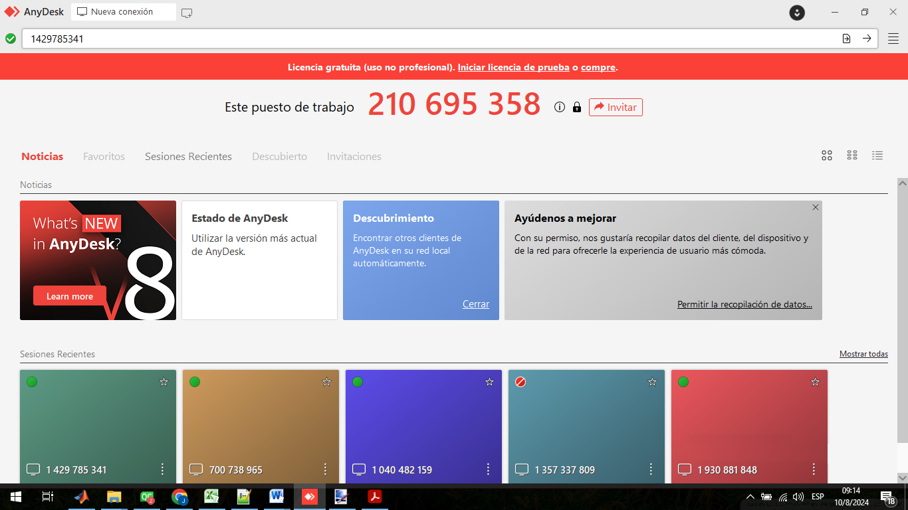
   
   Pantalla de Conexión Remota

Una vez que se habilita el acceso va a observar en el recuadro del programa AnyDesk la pantalla del Suplementador.

Modo de Trabajo En el Suplementador
------------------------------------

Este modo de trabajo no requiere de más pasos, simplemente podrá presionar el botón del mouse o escribir con el teclado y visualizar los datos; agregar / quitar rodeos; cambiar los parámetros de alimentación como si estuviera 
en el lote o Activar / Desactivar el equipo para la Suplementación.
Una vez que terminó de utilizar se recomienda desconectarse para no consumir datos móviles cerrando el programa.

Modo de Trabajo en nuestra computadora
--------------------------------------

El primer paso es copiar el archivo de base de datos del equipo a nuestra computadora. Para eso debe acceder a la pantalla de gestión de archivos de AnyDesk haciendo click en el siguiente ícono:

La pantalla de gestión de archivos está dividida horizontalmente en dos partes:

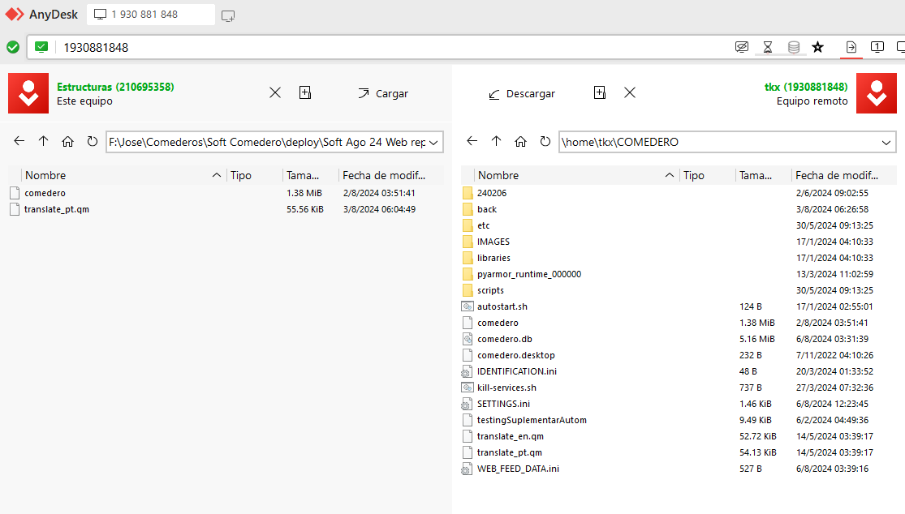
   
   Pantalla de Transferencia de Archivos

A la izquierda se ven los archivos de nuestra computadora y a la derecha se ven los archivos de la computadora del Suplementador. En las barras superiores se muestra la dirección de los directorios que se están visualizando.
Debemos buscar en la barra de la izquierda (nuestra computadora) el directorio en el que tenemos instalado el programa de Suplementar (por ejemplo C:\Suplementar ) en el que vamos a ver entre otros archivos: comedero.exe (programa ejecutable) y comedero.db (base de datos) .
En la barra de la derecha (Suplementador) debemos estar ubicados en: \home\tkx\COMEDERO.
Para transferir el archivo de base de datos desde el Suplementador a nuestra computadora debemos seleccionar el archivo comedero.db en la lista de la derecha (Suplementador) y presionar en el botón Descargar:

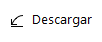

Al presionar este botón aparecerá una ventana pequeña que muestra el progreso de transferencia del archivo y avisa cuando el archivo se descargó por completo.
Una vez realizada la transferencia podemos cerrar el programa AnyDesk para trabajar en forma local en nuestra computadora.

Trabajando con el Software en nuestra computadora
-------------------------------------------------

Una vez descargada la base de datos podemos ejecutar el programa en nuestra computadora ejecutando el archivo comedero.exe que se encuentra en la carpeta donde hemos extraído el archivo comprimido provisto por Suplementar.
Al ejecutar ese archivo se abre el software de Suplementar donde nos avisará que No se encuentra el hardware (nuestra computadora no está conectada a las placas electrónicas que se encuentran en el suplementador) y nos dirá que se activa el Modo Demostración,
en donde no se puede habilitar el Modo Automático. Sin embargo se podrá trabajar para ver reportes; guardarlos; cambiar la configuración de alimento; agregar / quitar Rodeo o Animales.

**Guardando archivos en nuestra computadora**

Cuando generamos un Reporte y utilizamos la opción guardar en PDF, o cuando generamos vamos a la opción Exportar en formato .xml, el archivo correspondiente se guardará en la carpeta donde trabaja el Software. El nombre incluirá la fecha y hora en la que fue 
generado para poder diferenciarlos.

**Cargar en el Suplementador una configuración editada en nuestra computadora**

En el caso en que deseemos trabajar en nuestra computadora para configurar Rodeos, Animales y/o Configuración de Alimentación para que luego el equipo trabaje con esta configuración editada podemos trabajar con un archivo que hayamos descargado del Suplementador 
como se explicó en el punto anterior o podemos limpiar la base de datos utilizando la opción ubicada en Gestión de Datos -> Limpiar Base de Datos.
En esta opción podemos borrar todos los registros de comidas e incluso borrar toda la información para definir los Rodeos y Animales desde cero.
Una vez editados los aspectos que deseamos trabajando en nuestra computadora podemos subir la base de datos desde nuestra computadora al Suplementador haciendo la transferencia de archivos mediante el programa AnyDesk en forma opuesta a la descripta en el punto anterior.
Antes de transferir el archivo debemos ingresar al AnyDesk y cerrar el programa que se está ejecutando en el Suplementador. Para esto debemos ir a la Opción Programar> Salir e ingresar la contraseña 1-3-5-2-4-6 y presionar “Ok”. Al hacer esto se cierra el programa y se 
ve el fondo de pantalla del sistema operativo.
Debemos luego ir a la pantalla de gestión de archivos de AnyDesk haciendo click en el ícono:

Para transferir el archivo de base de datos desde nuestra computadora al Suplementador debemos seleccionar el archivo *comedero.db* en la lista de la izquierda (Computadora) y presionar en el botón Cargar:

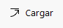

Al presionar este botón aparecerá una ventana pequeña que muestra el progreso de transferencia del archivo y avisa cuando el archivo se descargó por completo.

**Importante:** Se actualizarán todos los cambios en el equipo y se perderá la información que el equipo guardó en el período desde el cual se sacó la base de datos desde el equipo.

Una vez transferido el archivo debemos iniciar el programa en el Suplementador, presionando en el siguiente ícono de AnyDesk:

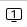

Para iniciar el programa de Suplementar esto se debe presionar el ícono:

Este ícono se encuentra en la barra de abajo del sistema operativo (si no se ve la barra se debe acercar el puntero al extremo inferior de la pantalla). Tenga la precaución presionar una sola vez y 
esperar 10 segundos que demora el establecimiento de la comunicación con protocolo de seguridad con las placas electrónicas.

Finalmente en el software de Suplementar deberá activar el Modo Automático para que el equipo quede activo y suministre alimento con la configuración editada.

.. _recomenUso:

Recomendaciones de Uso
======================

Para un óptimo funcionamiento del equipo se sugiere seguir las siguientes recomendaciones.

* **No adosar equipos eléctricos a las baterías**

Las baterías del suplementador están diseñadas para que el equipo pueda operar durante largos períodos de menor producción fotovoltaica. Conectar dispositivos externos no 
solo puede disminuir la capacidad de operación durante períodos nublados sino que también puede generar interferencia electrónica. (Ej.: no conectar boyero eléctrico).  

* **Limpiar panel fotovoltaico cuando sea necesario**

La suciedad puede reducir considerablemente el rendimiento de los paneles fotovoltaicos. Incluso la suciedad muy concentrada en una zona del panel que no se limpia 
durante mucho tiempo, como puede ser un excremento de pájaro, puede acabar dañando el panel. Si bien el sistema fue dimensionado para tener en cuenta el ambiente de trabajo 
se recomienda limpiar los paneles con regularidad para un óptimo funcionamiento.

* **No dejar que la máquina se quede sin alimento**

La tolva del equipo tiene un volumen de almacenamiento que permite una autonomía de varios días entre carga y carga de suplemento. Este período depende del consumo diario, 
que se puede calcular como la cantidad de animales habilitados por la ración diaria que se les asigna. La frecuencia con la que se debe cargar el suplemento en el equipo 
se calcula dividiendo la capacidad de la tolva por el consumo diario. Si no se realiza la carga del equipo y el mismo se queda sin alimento, quedarán grabados registros de 
alimentación que en realidad no ocurrieron.

* **Utilizar pulsadores para llenar dosificadores por primera vez**

Al poner en funcionamiento el equipo por primera vez y luego de que la tolva se haya vaciado, se debe llenar el tornillo sin fin de los dosificadores para dejarlos listos. 
Para esto se han colocado pulsadores en el lado interno de las bocas de alimentación. 

* **Calibrar dosificadores al cambiar el tipo de suplemento**

Al cambiar el tipo de suplemento o al poner en funcionamiento el equipo por primera vez se debe calibrar los dosificadores, ya que el equipo calcula la dosis suministrada 
por tiempo. Para esto se deben seguir las instrucciones que se detallan más adelante en este manual, en la sección de programación del equipo y se debe disponer de 
una pequeña balanza de cocina para pesar dosis de aproximadamente 1 kilogramo.

* **Familiarizar animales con equipo antes de comenzar con Plan de Suplementación**.

| Antes de empezar a utilizar el equipo con un rodeo que no conoce el mismo es deseable seguir el siguiente procedimiento para acostumbrarlos y conseguir un óptimo funcionamiento, 
 con el que se logra familiarizar el rodeo en el plazo de un par de días. 
| Se recomienda encerrar los animales el día anterior al comienzo del acostumbramiento con el objetivo 
 de que tengan hambre. 
| Programar el suplementador con una ración de 2kg con 20 fracciones cada 30 segundos (de esta forma logramos que la máquina se accione varias veces y el animal pierda el miedo). 
| Ubicar el suplementador en el corral y encerrar el rodeo en el mismo sin suministrarle alimento extra, se recomienda acostumbrar de a 30 animales. 
| Con el objetivo de que el animal ingrese al suplementador se puede colocar alfalfa fresca en las bocas para promover que algún animal ingrese por primera vez. Los animales 
 reaccionan rápidamente al equipo con el suministro de alimento. Luego de 3 horas de uso se puede identificar a los animales que han ingresado varias veces desde la sección de 
 reportes, lo que indica que estos animales han aprendido a utilizar el equipo. 
| Es recomendable sacar del corral a los animales acostumbrados para dejar solamente a los más 
 temerosos para su acostumbramiento. Repetir este procedimiento hasta que todos los animales hayan entrado a comer. 
| En caso de ser necesario, es recomendable repetir este procedimiento de acostumbramiento para aquellos animales que no ingresan al equipo en un periodo de suplementación.    
| Puede ver el proceso de familiarización en este `Link de Video de Familiarización <https://youtu.be/PGTw0lOybs4>`_

* **Regular las rejas de acuerdo al tamaño de los animales**

Se recomienda regular el ancho de las rejas de acuerdo a la categoría de los animales para que sólo uno pueda acceder a la boca de alimentación a la vez. También es posible 
regular el ancho de los laterales de la boca de acceso.

* **Mover el equipo por el lote periódicamente**

Mover el equipo para aumentar la eficiencia de cosecha de la pastura y mejorar la distribución de eyecciones.
Es deseable colocar el equipo lejos del lugar donde se ubica el agua para favorecer el movimiento de los animales dentro del lote. A su vez es recomendable mover el equipo 
periódicamente, lo que mejora el aprovechamiento de la pastura y favorece la distribución de las eyecciones de los animales por el lote.

* **Utilizar preferentemente varias fracciones relativamente pequeñas**

El equipo brinda la posibilidad de suministrar la dosis diaria asignada en varias fracciones al día. Es deseable dividir la alimentación en más de 3 veces al día y 
configurar el equipo para que las fracciones individuales no superen los 500 gramos, de esta forma la fracción es consumida de manera completa en poco tiempo, lo que
minimiza las posibilidades de robo de comida por otro animal. A su vez se recomienda limitar la cantidad de fracciones a 8 o menos, ya que una gran cantidad de fracciones 
va en contra de la cantidad de animales que es posible manejar con un equipo debido al aumento de la frecuencia necesaria para que se cumpla el esquema completo. 
Por último, se sugiere utilizar raciones mayores a 100 gramos para lograr una mayor precisión de la dosificación. Por ejemplo, se sugieren las siguientes configuraciones:

+-----------------------------+---------------------------+------------------------------+
| Dosis Diaria [gramos/día]   | Cantidad de Fracciones    |   Peso de Fracción [gramos]  |
+-----------------------------+---------------------------+------------------------------+
|          600                |            3              |            200               |
+-----------------------------+---------------------------+------------------------------+
|         1000                |            3              |            333               |
+-----------------------------+---------------------------+------------------------------+
|         1500                |            4              |            375               |
+-----------------------------+---------------------------+------------------------------+
|         2000                |            5              |            400               |
+-----------------------------+---------------------------+------------------------------+
|         2500                |            6              |            417               |
+-----------------------------+---------------------------+------------------------------+
|         3000                |            7              |            429               |
+-----------------------------+---------------------------+------------------------------+

* **Diluir aquellos productos de baja administración como urea, vitaminas o minerales**

Diluir aquellos productos de baja administración utilizando maíz molido u otro alimento. 
Para aquellos productos que se deben suministrar en pequeñas dosis se sugiere utilizarlos mezclándolos con maíz molido para mejorar la precisión de la cantidad suministrada, 
ya que el equipo está diseñado para suministrar dosis de suplementación en el orden descrito en el punto anterior. Tener en cuenta que pueden existir animales que roban alimento 
y de esta forma aumentar considerablemente su consumo.

* **Dar una ración mínima a todos los animales que permanezcan junto con la máquina**

Cuando a un animal o grupo de animales que están en el lote se le desea cortar la suplementación se sugiere mantener una ración mínima, por ejemplo de 100 gramos por día, 
a los efectos de que los animales no pierdan la costumbre de utilizar el equipo y sea posible de ser necesario arrancar con la suplementación nuevamente.

.. _operacion:

Operación
=========

**Regulador de Voltaje**

El equipo dispone de un regulador de voltaje que cumple la función de convertir la energía que genera el panel fotovoltaico al voltaje adecuado para cargar las baterías y operar el equipo. 
El encendido o apagado del equipo se activa presionando el botón inferior *ON/OFF*. Mediante los botones botón *MENU* y los botones arriba/abajo *UP/DOWN* y la pantalla LED 
es posible visualizar todos los parámetros de operación, incluyendo voltaje de las baterías, corriente de carga fotovoltaica y corriente de descarga.
 
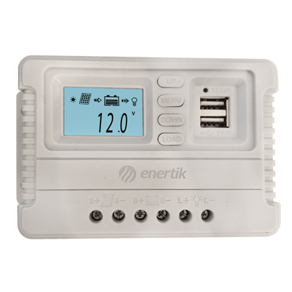
   
   Regulador de Voltaje de Paneles Solares

**Baterías de Ciclo Profundo**

El equipo viene dotado de dos baterías de ciclo profundo de larga duración que permite el funcionamiento del equipo aún en períodos prolongados de poca radiación solar. 
Ya que estas baterias están preparadas para un gran número de ciclos de carga y descarga tienen una duración esperada de más de tres años.

**Tablero Eléctrico**

Dentro del gabinete eléctrico se encuentran los componentes eléctricos y electrónicos que incluyen a la computadora principal, placas electrónicas para entradas y salidas, relés, fusíbles 
y llaves seccionadoras. No será necesario que el usuario abra el tablero y se recomienda no hacerlo.

Datos de Contacto
-----------------

**Contacto Directo**

Por información comercial contactarse a:

Correo: info@suplementarsas.com

Teléfono: +54 - 9 - 351 7305203 Dario Irico

Para consultas por asistencia técnica contactarse a:

Correo: asistencia@suplementarsas.com

Teléfono: +54 - 9 - 351 3599649 José Luperi

**Página Web**

.. _Sitio: https://www.suplementarsas.com/

Podrá ver más información en nuestra Sitio_.

**Instagram**

.. _Instagram: https://www.instagram.com/suplementarsas/?igshid=YmMyMTA2M2Y=

También nos puede encontrar en nuestro Instagram_.
